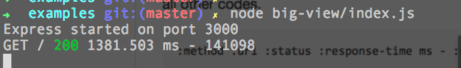
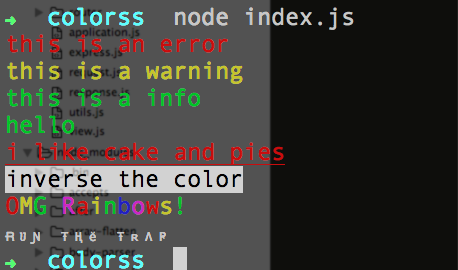

#Node 开源项目分类汇总

作为一个node初学者，发现上来就要跟一堆的node开源库打交道。这里整理一份常用的node库，以及他们的简单介绍和使用。持续更行中...

>欢迎大家推荐好的Node开源项目，欢迎star,fork :)

+ [**工具**](#工具)
    - 基本工具
    - 流程控制
    - 系统工具
+ [**字符串处理**](#字符串处理)
+ [**HTTP**](#http)
    - req 
    - resp
    - cookie && session 
    - 授权
    - socket
    - 网络安全
    - 网络工具
+ [**数据库处理**](#数据库处理)
    - mysql
    - redis
    - mongodb
    - cache
+ [**Views**](#views)
    - 模板(jade,ejs)
    - 控件处理
+ [**测试**](#测试)
    - 测试工具
    - CI
+ [**异常处理**](#异常处理)
    - 错误处理
    - 日志
    - 监控
    - 调试
+ [**框架**](#框架)    
+ [**开源项目**](#开源项目)
+ [**学习资料**](#学习资料)
+ [**People**](#people)

## 工具

### 普通工具
[utility](https://github.com/node-modules/utility) A collection of useful utilities
```
utils.md5('@移动开发小冉');
utils.sha1('nonstriater', 'base64');
utils.hmac('sha1', 'I am a key', 'hello world');
utils.base64decode('5L2g5aW977-l', true); 
```

[bcrypt](https://github.com/ncb000gt/node.bcrypt.js)     跨平台的文件加密工具
```
var bcrypt = require('bcrypt');
bcrypt.genSalt(10, function(err, salt) {
    bcrypt.hash('B4c0/\/', salt, function(err, hash) {
        // Store hash in your password DB.
    });
});
//sync
var hash = bcrypt.hashSync('B4c0/\/', salt);
```

[crypto-js](https://github.com/brix/crypto-js) JavaScript library of crypto standards
```
// Encrypt
var ciphertext = CryptoJS.AES.encrypt('my message', 'secret key 123');

// Decrypt
var bytes  = CryptoJS.AES.decrypt(ciphertext.toString(), 'secret key 123');
```

[moment](https://github.com/moment/moment) 时间格式处理

```
moment().format('MMMM Do YYYY, h:mm:ss a'); // October 5th 2015, 7:48:22 pm
moment("20111031", "YYYYMMDD").fromNow(); // 4 years ago
moment().subtract(10, 'days').calendar(); // 09/25/2015
moment().format('lll');  // Oct 5, 2015 7:49 PM
```
更多使用参考 [官方文档](http://momentjs.com/)

[utils-merge](https://github.com/jaredhanson/utils-merge) 合并2个对象的属性
```
var a = { foo: 'bar' }
  , b = { bar: 'baz' };

merge(a, b);
// => { foo: 'bar', bar: 'baz' }
```

[cron](https://github.com/ncb000gt/node-cron)   cron 定时任务
```
var CronJob = require('cron').CronJob;
new CronJob('* * * * * *', function() {
  console.log('You will see this message every second');
}, null, true, 'America/Los_Angeles');
```
其中，cron格式 ‘秒，分，时，日，月，周 ’，*表示1。

[compression](https://github.com/expressjs/compression)  压缩的中间件,支持gzip和deflate

[depd](https://github.com/dougwilson/nodejs-depd)  deprecate all the things

[serve-favicon](https://github.com/expressjs/serve-favicon/blob/master/index.js)

[lodash](https://github.com/lodash/lodash/)     js工具库 
[lodash api](https://lodash.com/docs)


### 系统工具
[nodemailer](https://github.com/andris9/Nodemailer) 邮件发送服务
```
// create reusable transporter object using SMTP transport
var transporter = nodemailer.createTransport({
    service: 'Gmail',
    auth: {
        user: 'gmail.user@gmail.com',
        pass: 'userpass'
    }
});

// NB! No need to recreate the transporter object. You can use
// the same transporter object for all e-mails

// setup e-mail data with unicode symbols
var mailOptions = {
    from: 'Fred Foo ✔ <foo@blurdybloop.com>', // sender address
    to: 'bar@blurdybloop.com, baz@blurdybloop.com', // list of receivers
    subject: 'Hello ✔', // Subject line
    text: 'Hello world ✔', // plaintext body
    html: '<b>Hello world ✔</b>' // html body
};

// send mail with defined transport object
transporter.sendMail(mailOptions, function(error, info){
    if(error){
        return console.log(error);
    }
    console.log('Message sent: ' + info.response);

});

```


[qrcode](https://github.com/soldair/node-qrcode)  二维码生成器

### 流程控制
[async](https://github.com/caolan/async)  异步控制,控制并发
```
async.forEach();
async.forEachLimit() 
async.map() 过滤集合
async.filter() 异步操作对集合过滤
async.reject() 结果与filter()相反
async.reduce() 
async.detect() 得到集合里满足条件的第一个元素

async.some() 至少一个元素满足指定条件，callback得到true
async.every()  每个元素都满足指定条件，callback得到true

async.series() 顺序执行函数
async.paralle() 并行执行多个函数

async.whilst()
async.until()

async.waterfall() 前一个函数返回值作为后一个函数的输入
async.queue() 创建串行队列
```


[eventproxy](https://github.com/JacksonTian/eventproxy)  An implementation of task/event based asynchronous pattern
事件代理，避免事件的深度嵌套回调

[Bluebird](https://github.com/petkaantonov/bluebird)  改进异步流程的深层嵌套逻辑


[cheerio](https://github.com/cheeriojs/cheerio)    为服务器定制的，JQuery核心实现,  分析网页用。 
```
var $ = cheerio.load(sres.text);
$('#topic_list .topic_title').each(function(idx,element){
  ...
});
```

[after](https://github.com/Raynos/after)
All the flow control you'll ever need

[on-finished](https://github.com/jshttp/on-finished)  Execute a callback when a request closes, finishes, or errors


## 字符串处理

[validator](https://github.com/chriso/validator.js)  字符串校验
```
validator.isEmail('foo@bar.com'); //=> true
validator.isWhitespace('    \t\r\n');// => true
```


[qs](https://github.com/hapijs/qs)
A querystring parser with nesting support
```
var obj = Qs.parse('a=c');    // { a: 'c' }
var str = Qs.stringify(obj);  // 'a=c'
```

[marked](https://github.com/chjj/marked) markdown 解析器

同步调用方式
```
fs.readFile(path, 'utf8', function(err, str){
    if (err) return fn(err);
    try {
      var html = md(str);
      html = html.replace(/\{([^}]+)\}/g, function(_, name){
        return options[name] || '';
      });
      fn(null, html);
    } catch(err) {
      fn(err);
    }
  });
```

异步调用方式
```
// Using async version of marked
marked(markdownString, function (err, content) {
  if (err) throw err;
  console.log(content);
});
```

[node-uuid](https://github.com/broofa/node-uuid)  Generate RFC-compliant UUIDs in JavaScript
```
// Generate a v1 (time-based) id
uuid.v1(); // -> '6c84fb90-12c4-11e1-840d-7b25c5ee775a'

// Generate a v4 (random) id
uuid.v4(); // -> '110ec58a-a0f2-4ac4-8393-c866d813b8d1'
```


[escape-html](https://github.com/component/escape-html)  string html转换 
```
var escape = require('escape-html');
var html = escape('foo & bar');
// -> foo &amp; bar
```

[path-to-regexp](https://github.com/pillarjs/path-to-regexp)
Turn an Express-style path string such as /user/:name into a regular expression.
```
var keys = []
var re = pathToRegexp('/foo/:bar', keys)
// re = /^\/foo\/([^\/]+?)\/?$/i
// keys = [{ name: 'bar', prefix: '/', delimiter: '/', optional: false, repeat: false, pattern: '[^\\/]+?' }]
```


[multiline](https://github.com/sindresorhus/multiline) Multiline strings in JavaScript

before:
```
var str = '' +
'<!doctype html>' +
'<html>' +
'   <body>' +
'       <h1>❤ unicorns</h1>' +
'   </body>' +
'</html>' +
'';
```

after:
```
var str = multiline(function(){/*
<!doctype html>
<html>
    <body>
        <h1>❤ unicorns</h1>
    </body>
</html>
*/});

```


## HTTP

### req && resp

[request](https://github.com/request/request)  Simplified HTTP request client
```
var request = require('request');
request('http://www.google.com', function (error, response, body) {
  if (!error && response.statusCode == 200) {
    console.log(body) // Show the HTML for the Google homepage.
  }
})
```


[accepts](https://github.com/jshttp/accepts)   http(s) header Accept 设置和解析

[content-disposition](https://github.com/jshttp/content-disposition)  http(s) header Content-Disposition 设置和解析

[content-type](https://github.com/jshttp/content-type) http(s) header Content-Type 设置和解析

[range-parser](https://github.com/jshttp/range-parser) 
Range header field parser

[parseurl](https://github.com/pillarjs/parseurl) Parse the URL of the given request object

[methods](https://github.com/jshttp/methods)   保证http method 都是小写字符串

[body-parser](https://github.com/expressjs/body-parser) multipart body 解析.只负责处理 JSON，Raw，text,URL-encoded body的解析
```
//解析url 编码的body application/x-www-form-urlencoded
bodyParser(urlencoded())

// parse application/json, limit指定request不超过1MB
app.use(bodyParser.json({limit: '1mb'}));
```
其依赖的库有(from package.json)：
```
  "dependencies": {
    "bytes": "2.1.0",
    "content-type": "~1.0.1",
    "debug": "~2.2.0",
    "depd": "~1.1.0",
    "http-errors": "~1.3.1",
    "iconv-lite": "0.4.12",
    "on-finished": "~2.3.0",
    "qs": "5.1.0",
    "raw-body": "~2.1.4",
    "type-is": "~1.6.9"
  },
  "devDependencies": {
    "istanbul": "0.3.21",
    "methods": "~1.1.1",
    "mocha": "2.2.5",
    "supertest": "1.1.0"
  }
```

[raw-body](https://github.com/stream-utils/raw-body)  从可读的stream中获取有效的 row body.

[multiparty](https://github.com/andrewrk/node-multiparty/)
A node.js module for parsing multipart-form data requests which supports streams2
解析content-type为multipart/form-data的request
```
http.createServer(function(req, res) {
  if (req.url === '/upload' && req.method === 'POST') {
    // parse a file upload
    var form = new multiparty.Form();

    form.parse(req, function(err, fields, files) {
      res.writeHead(200, {'content-type': 'text/plain'});
      res.write('received upload:\n\n');
      res.end(util.inspect({fields: fields, files: files}));
    });

    return;
  }
  // show a file upload form
  res.writeHead(200, {'content-type': 'text/html'});
  res.end(
    '<form action="/upload" enctype="multipart/form-data" method="post">'+
    '<input type="text" name="title"><br>'+
    '<input type="file" name="upload" multiple="multiple"><br>'+
    '<input type="submit" value="Upload">'+
    '</form>'
  );
}).listen(8080);
```


[busboy](https://github.com/mscdex/busboy)  formdata处理， 文件上传，表单处理中间件
```
var busboy = new Busboy({ headers: req.headers });
    busboy.on('file', function(fieldname, file, filename, encoding, mimetype) {
      console.log('File [' + fieldname + ']: filename: ' + filename + ', encoding: ' + encoding + ', mimetype: ' + mimetype);
      file.on('data', function(data) {
        console.log('File [' + fieldname + '] got ' + data.length + ' bytes');
      });
      file.on('end', function() {
        console.log('File [' + fieldname + '] Finished');
      });
    });
    busboy.on('field', function(fieldname, val, fieldnameTruncated, valTruncated) {
      console.log('Field [' + fieldname + ']: value: ' + inspect(val));
    });
    busboy.on('finish', function() {
      console.log('Done parsing form!');
      res.writeHead(303, { Connection: 'close', Location: '/' });
      res.end();
    });
    req.pipe(busboy);
```

[multer](https://github.com/expressjs/multer) 文件上传中间件
```
var multer = require('multer');
var uploadingOption = multer({
  dest: __dirname + '../public/uploads/',
  // 设定限制，每次最多上传1个文件，文件大小不超过1MB
  limits: {fileSize: 1000000, files:1},
});

router.post('/upload', uploadingOption, function(req, res) {
});
```

[send](https://github.com/pillarjs/send)
Send is a library for streaming files from the file system as a http response supporting partial responses (Ranges), conditional-GET negotiation

[superagent](https://github.com/visionmedia/superagent)  客户端网络请求HTTP模块， 抓取网页 [使用参考](https://cnodejs.org/topic/5378720ed6e2d16149fa16bd)
```
superagent.get('https://cnodejs.org/')
    .end(function (err, sres) {
    ...

  });
```


[serve-static](https://github.com/expressjs/serve-static)
Create a new middleware function to serve files from within a given root directory

[type-is](https://github.com/jshttp/type-is)
Infer the content-type of a request

[method-override](https://github.com/expressjs/method-override)
前端浏览器的form只能使用GET或POST方法，后后端只有一个对应的PUT的API。这时，我们需要用method-override将POST/GET改成PUT

```
app.use(require('method-override')());
```


[finalhandler](https://github.com/pillarjs/finalhandler)  final http responder


### cookie && session

**cookie机制是在客户端保持状态的方案，session是服务器保持状态的方案**

[cookie](https://github.com/jshttp/cookie) cookie serialization and parsing for node.js

[cookie-signature](https://github.com/tj/node-cookie-signature) cookie signing

[cookie-parser](https://github.com/expressjs/cookie-parser)  cookie parsing middleware
```
app.use(cookieParser('my secret here'));
res.cookie('remember', 1, { maxAge: minute });
res.clearCookie('remember');
```

[cookie-session](https://github.com/expressjs/cookie-session)
Simple cookie-based session middleware

```
app.use(cookieSession({ secret: 'manny is cool' }));
req.session.count
req.session.regenerate()
req.session.destroy()
```


[express-session](https://github.com/expressjs/session) Express session中间件
Create a session middleware with the given options
```
app.use(session({
  resave: false, // don't save session if unmodified
  saveUninitialized: false, // don't create session until something stored
  secret: 'shhhh, very secret'
}));
```

### 授权

[passport](https://github.com/jaredhanson/passport)    登录认证，较少模块耦合,使用策略模式通过插件的方式支持多种验证方式。最基本的username/password 验证
```
var passport = require('passport')
  , LocalStrategy = require('passport-local').Strategy;

passport.use(new LocalStrategy(
  function(username, password, done) {
    User.findOne({ username: username }, function(err, user) {
      if (err) { return done(err); }
      if (!user) {
        return done(null, false, { message: '用户名不存在.' });
      }
      if (!user.validPassword(password)) {
        return done(null, false, { message: '密码不匹配.' });
      }
      return done(null, user);
    });
  }
));
```
如果前段表单里面usernameFiled/passwordField 需要自定义，可以在LocalStrategy()构造函数里面传一个option作为第一个参数：

```
passport.use(new LocalStrategy({
    usernameField: 'email',
    passwordField: 'passwd'
  },
  function(username, password, done) {
    // ...
  }
));
```

常用api解释：

```
passport.initialize()
passport.session()
passport.serializeUser(function(user, done) {})  user对象中的数据序列化到session中
passport.deserializeUser(function(id, done) {})  从用户提交的session中提取sessionId，然后从数据库中查询

passport.authenticate(name,option,callback)

```


[passport-github](https://github.com/jaredhanson/passport-github) passport github授权插件

```
var passport = require('passport')
  , GithubStrategy = require('passport-github').Strategy;
  
//passport设置部分 
passport.use(new GithubStrategy({
    clientID: GITHUB_CLIENT_ID,
    clientSecret: GITHUB_CLIENT_SECRET,
    callbackURL: "http://www.example.com/auth/github/callback"
  },
  function(accessToken, refreshToken, profile, done) {
    User.findOrCreate(..., function(err, user) {
      if (err) { return done(err); }
      done(null, user);
    });
  }
));
```

### socket

[ws](https://github.com/websockets/ws)  Node.js中 WebSocket协议实现

[Socket.io](https://github.com/socketio/socket.io)


### 网络安全

[xss](https://github.com/leizongmin/js-xss) 根据白名单过滤HTML(防止XSS攻击)

[csurf](https://github.com/expressjs/csurf)    CSRF(cross-site request forgery)  token 创造和验证

[cors](https://github.com/expressjs/cors)   （cross-origin resource sharing） 跨域请求
A node.js package that provides an Express/Connect middleware to enable Cross Origin Resource Sharing (CORS) with various options

[helmet](https://github.com/helmetjs/helmet)  安全性组件：xss跨站脚本，脚本注入，非安全请求
Help secure Express apps with various HTTP headers

[captchagen](https://github.com/contra/captchagen) 验证码生成器，依赖canvas库


### 网络工具

[vhost](https://github.com/expressjs/vhost)   虚拟域名主机。 ip下可以部署多个不同域名站点


[proxy-addr](https://github.com/jshttp/proxy-addr)  Determine address of proxied request


## 数据库处理

### mysql
[mysql](https://github.com/felixge/node-mysql)  mysql协议的node实现
```
var db = mysql.createConnection(config);
db.connect(handleError);
db.on('error', handleError);
```
这里监听error时间重连数据库

为避免建立mysql连接对内存资源的占用，避免高访问量时数据库内存溢出风险，常使用mysql连接池机制。mysql 连接池的使用如下：
```
var mysql = require('mysql');
var pool  = mysql.createPool(config);

pool.getConnection(function(err, connection) {
  // Use the connection
  connection.query( 'SELECT something FROM sometable', function(err, rows) {
  });
});
```

### redis
[connect-redis](https://github.com/tj/connect-redis)  redis存储session数据
```
var RedisStore = require('connect-redis')(session);
app.use(session({
  resave: false, // don't save session if unmodified
  saveUninitialized: false, // don't create session until something stored
  secret: 'keyboard cat',
  store: new RedisStore
}));
```


[redis](https://github.com/NodeRedis/node_redis) redis client for nodejs

[ioredis](https://github.com/luin/ioredis) A robust, performance-focused and full-featured Redis client for Node and io.js

### mongodb

[node-mongodb-native](https://github.com/mongodb/node-mongodb-native.git) MongoDB nodeJS驱动
```
var mongoClient = require('mongodb').MongoClient
  , assert = require('assert');

var url = 'mongodb://localhost:27017/mgdbdemo';
mongoClient.connect(url, function(err, db) {
  assert.equal(null, err);
  console.log("Connected correctly to server");
  db.close();
});
```

比如：updateOnce() 更新文档
```
var updateDocument = function(db, callback) {
  // Get the documents collection
  var collection = db.collection('documents');
  // Update document where a is 2, set b equal to 1
  collection.updateOne({ a : 2 }
    , { $set: { b : 1 } }, function(err, result) {
    assert.equal(err, null);
    assert.equal(1, result.result.n);
    console.log("Updated the document with the field a equal to 2");
    callback(result);
  });  
}
```


[mongoose](https://github.com/Automattic/mongoose)  MongoDB object modeling designed to work in an asynchronous environment 

```
var mongoose = require('mongoose');
mongoose.connect('mongodb://localhost/my_database');

var ReplySchema = new Schema({
  content: { type: String },
  topic_id: { type: ObjectId},
  author_id: { type: ObjectId },
  reply_id: { type: ObjectId },
  create_at: { type: Date, default: Date.now },
  update_at: { type: Date, default: Date.now },
  content_is_html: { type: Boolean },
  ups: [Schema.Types.ObjectId],
  deleted: {type: Boolean, default: false},
});

var reply = mongoose.model('Reply', ReplySchema);

save()
find()

```


[mongoskin](https://github.com/kissjs/node-mongoskin) The promise wrapper for node-mongodb-native

[connect-mongodb](https://github.com/treygriffith/connect-mongodb)
SessionStorage for connect's session middleware

### ORM

[bookshelf](https://github.com/tgriesser/bookshelf) ORM for Mysql,Sqlite
基于 knex.js 库

[knex](https://github.com/tgriesser/knex) 


### cache
[memory-cache](https://github.com/ptarjan/node-cache)A simple in-memory cache for nodejs


## Views

### 模板
[ejs](https://github.com/tj/ejs)
Embedded JavaScript templates for node

```
<% include error_header %>
<% if (user) { %>
    <h2><%= user.name %></h2>
<% } %>
<% include footer %>
```

[jade](https://github.com/jadejs/jade) 
Jade - robust, elegant, feature rich template engine for Node.js 


[express-hbs](https://github.com/barc/express-hbs) expresshandlebars模板引擎  

[handlebars](https://github.com/wycats/handlebars.js) handlebars模板引擎
```
{ { argument } }    // 解析为字符串
{ { { argument } } } // 解析为 HTML
```

[Juicer](https://github.com/PaulGuo/Juicer) JS模板引擎


### 控件处理

[loader](https://github.com/JacksonTian/loader)  静态资源加载工具,用于发布模式下进行资源压缩和合并

[canvas](https://github.com/Automattic/node-canvas)  图像图片处理库
Node canvas is a Cairo backed Canvas implementation for NodeJS


## 测试

### 测试工具
[mocha](https://github.com/mochajs/mocha) BDD模式测试框架,支持多种assert，支持同步和异步测试

[should](https://github.com/shouldjs/should.js) BDD 模式断言库

[supertest](https://github.com/visionmedia/supertest) 模拟http request测试

[fresh](https://github.com/jshttp/fresh) HTTP request freshness testing

[beachmark](https://github.com/bestiejs/benchmark.js) 测试执行时间效率

[coveralls](https://github.com/nickmerwin/node-coveralls)  代码测试覆盖率

[istanbul](https://github.com/gotwarlost/istanbul) 代码测试覆盖率


### CI

[gruntjs](http://gruntjs.com/)  基于node的自动化任务运行器。对于一些重复的任务比如压缩，编译，单元测试，代码检查，打包发布，可以使用grunt处理，简化我们的工作


## 异常处理

### 错误处理

[errorhandle](https://github.com/expressjs/errorhandler) 错误处理中间件
如下，结合node-notifier处理错误信息：
```
var errorhandler = require('errorhandler')
var notifier = require('node-notifier')
if (process.env.NODE_ENV === 'development') {
  // only use in development
  app.use(errorhandler({log: errorNotification}))
}

function errorNotification(err, str, req) {
  var title = 'Error in ' + req.method + ' ' + req.url
  notifier.notify({
    title: title,
    message: str
  })
}
```

[jshint](https://github.com/jshint/jshint)  静态代码分析工具，默认使用 .jshintrc 文件作为配置文件
```
npm install -g jshint
jshint app.js
```


### 日志

[morgan](https://github.com/expressjs/morgan)
HTTP request log 中间件

```
var logger = require('morgan');
app.use(logger('dev'));
```

预定义的格式有：combined,common,dev,short,tiny，比如dev:
```
:method :url :status :response-time ms - :res[content-length]
```


[colors](https://github.com/Marak/colors.js)  get colors in your node.js console
```
var colors = require('colors');

console.log('hello'.green); // outputs green text
console.log('i like cake and pies'.underline.red) // outputs red underlined text
console.log('inverse the color'.inverse); // inverses the color
console.log('OMG Rainbows!'.rainbow); // rainbow
console.log('Run the trap'.trap); // Drops the bass
```


[debug](https://github.com/visionmedia/debug)  对console.log 封装，支持多种颜色输出


### 监控

[supervisor](https://github.com/petruisfan/node-supervisor.git) 监控代码的改动，重启node.js, 实现动态调试。适合开发环境

[forever](https://github.com/foreverjs/forever) 管理多个站点，监控能力弱

[nodemon](https://github.com/remy/nodemon) 监控代码的改动,自动重启node服务。

[pm2](https://github.com/Unitech/pm2)  node 进程管理方案，负载均衡。适合网站访问量大，需要完整监控的web


[Log.io](https://github.com/NarrativeScience/Log.io) 实时日志监控系统
```
1. sudo npm install -g log.io --user "<pc user>"
2. log.io-server
3. subl ~/.log.io/harvester.conf . like:
exports.config = {
    nodeName: "application_server",
    logStreams: {
      apache: [
        "/var/log/apache2/access.log",
        "/var/log/apache2/error.log"
      ]
    },
    server: {
      host: '0.0.0.0',
      port: 28777
    }
  } 

4. log.io-harvester
5. Browse to http://localhost:28778
```


[node-notifier](https://github.com/madhums/node-notifier)  处理app级别的通知。可实现邮件通知，apn


### 调试


[node-inspector](https://github.com/node-inspector/node-inspector)
```
//install
$ npm install -g node-inspector
//start debug
$ node-debug -p <port> app.js
//start node app
$ node app.js
//browser and trigger the br to starting debug
```

## 框架

[Express](https://github.com/strongloop/express.git)


[Sails.js](https://github.com/balderdashy/sails.git) MVC框架


[KOA](https://github.com/koajs/koa)  MVC框架，团队来自Express


[Meteor](https://github.com/meteor/meteor)  是Node.js上最出色的全栈框架，有庞大社区支持和文档。


[Derby](https://github.com/derbyjs/derby) 全栈框架


[Flatiron](https://github.com/flatiron/flatiron.git)


[Hapi](https://github.com/hapijs/hapi.git)  不依赖Express的node.js框架


[Mean](https://github.com/linnovate/mean)


[Mojito](https://github.com/yahoo/mojito)


[SocketStream](https://github.com/socketstream/socketstream)


## 开源项目

[short](https://github.com/edwardhotchkiss/short)  Promise-based Node.js URL Shortener backed by Mongoose.js
短域名服务，使用node和mongoose搭建。

下面的代码，搭建一个提供短域名跳转的http服务
```
var http = require("http");
var mongoose = require("mongoose");
var short = require("short");

mongoose.connect("mongodb://localhost/short");

var app = http.createServer(function(request, response) {
    var hash = request.url.slice(1);
    if (request.url === "/") {
        response.writeHead(200, { "Content-Type" : "text/html" });
        response.write("URL not found!");
        response.end();
    } else {
        short.get(hash, function(error, shortURLObject) {
            if (error) {
                console.error(error);
            } else {
                if (shortURLObject) {
                    var URL = shortURLObject[0].URL;
                    response.writeHead(302, {
                        "Location" : URL
                    });
                    response.end();
                } else {
                    response.writeHead(200, { "Content-Type" : "text/html" });
                    response.write("URL not found!");
                    response.end();
                }
            };
        });
    }
});

app.listen(8080);
console.log("> Open http://localhost:8080/kQ4c");
```

  
[nodeclub 源码](https://github.com/cnodejs/nodeclub.git)这是我学习到的第一个完整的node项目    

[Ghost 博客系统](https://github.com/tryghost/Ghost)  
[hexo 博客系统](https://github.com/hexojs/hexo/)
[看知乎](https://github.com/atonasting/zhihuspider)爬虫

## 学习资料

[node 资源列表](https://github.com/sindresorhus/awesome-nodejs) 
[阮一峰 node教程](http://javascript.ruanyifeng.com/nodejs/express.html)   
[《Node.js 包教包不会》](https://github.com/alsotang/node-lessons)

## People

[朴灵](http://github.com/JacksonTian/)  
[阮一峰](http://www.ruanyifeng.com/)  
[alsotang](https://github.com/alsotang/)  

# 联系

[移动开发小冉](http://weibo.com/ranwj)


